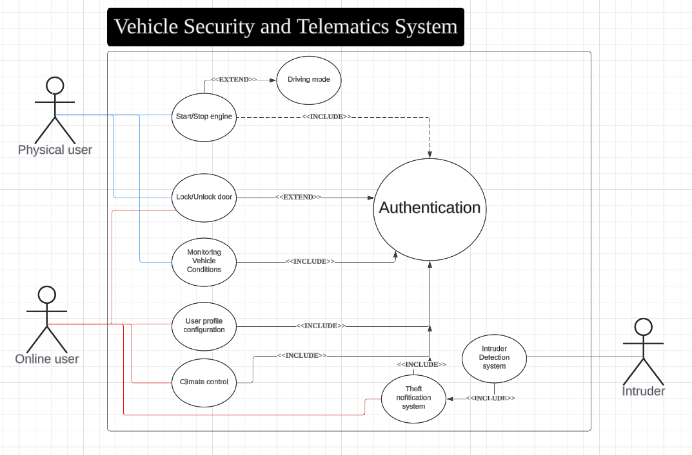
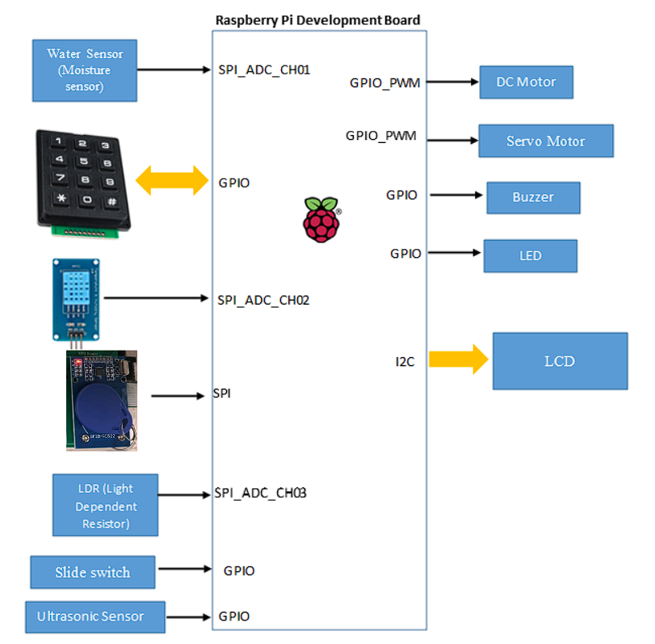
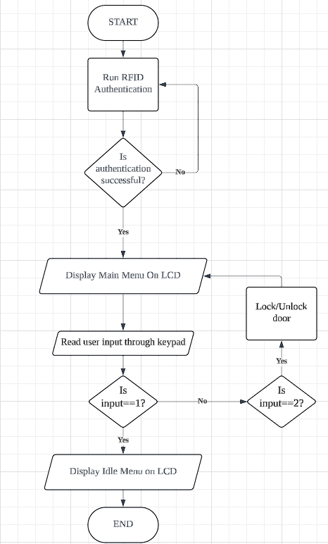
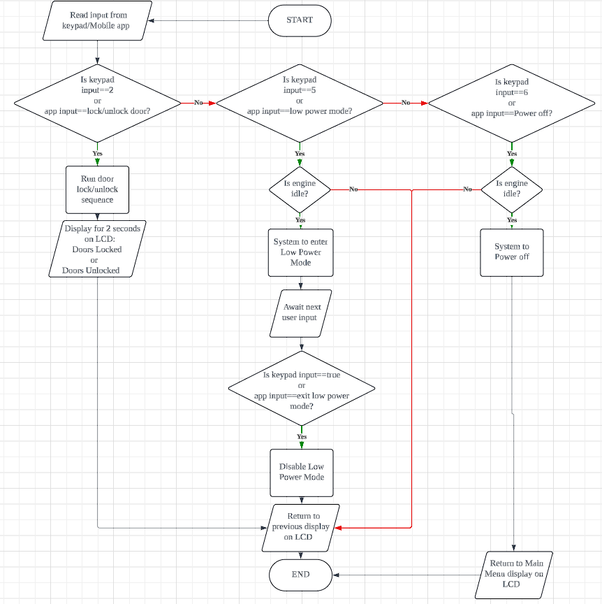
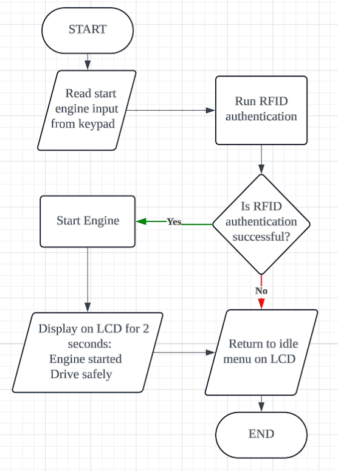
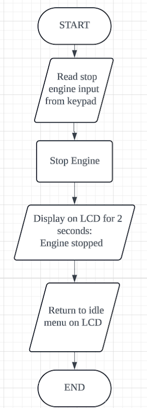
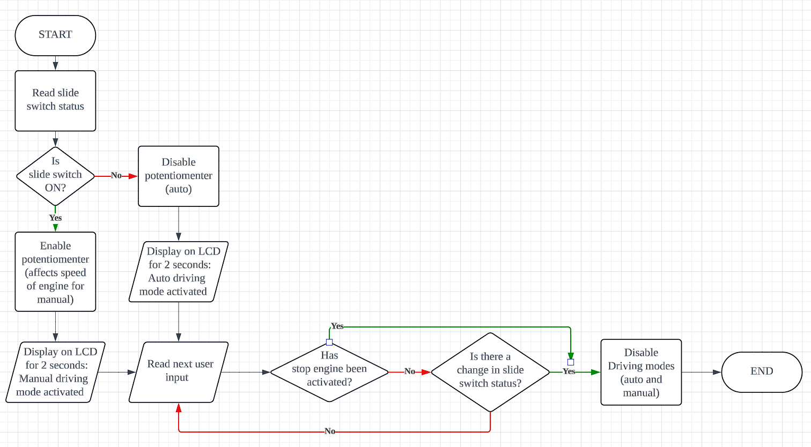
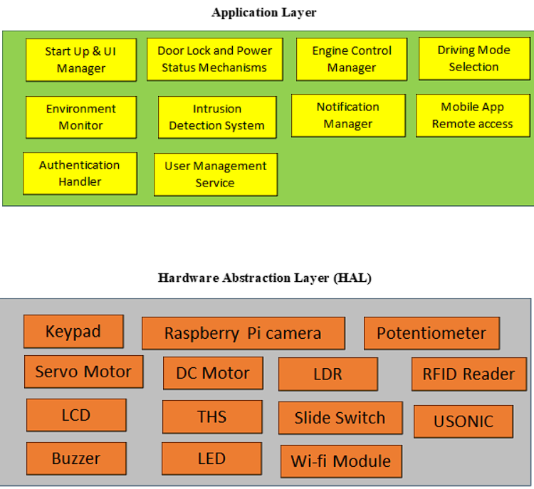

Document Version

| No | Update | Name | Date | Version |

| --- | --- | --- | --- | --- |

| 1. | Initial version |  |  | 1.0 |

Purpose

Intended Audience

This SRS document describes the System Requirements and Software Design for a vehicle security and telematics system and the target audience are System and Software Engineers working on the development of this project.

Intended Use

The SRS defines the overall System Architecture and Requirements as well as the SoftwareArchitecture and Design. This document also contains the definition of the SystemRequirements which shall be used as the input for System Test cases and Software Unit Testcases

Scope

This Software Requirements Specification (SRS) document outlines the functional and non-functional requirements of a Vehicle Security and Telematics System. It also defines the scope of both the system-level and software-level design, offering a comprehensive framework to guide system development, integration, and testing. The system is designed to enhance vehicle safety, monitor real-time data, and provide remote access and control features.

Definitions and Acronyms

| Acronym | Description |

| --- | --- |

| IR | Infra-Red |

| LED | Light Emitting Diode |

| LDR | Light Dependent Resistor |

| RainSens | Moisture Sensor |

| U SONIC | Ultrasonic Sensor |

| THS | Temperature and Humidity Sensor |

| RFID | Radio Frequency Identification |

| AC | Air Conditioning |

Overall System Description

Use Case Diagrams

System Architecture

GPIO_PWM   GPIO_PWM  SPI_ADC_CH03SPI_ADC_CH03SPI SPI DC MotorServo MotorSlide switchWater  Sensor (Moisture sensor)   SPI_ADC_CH01LCDI2CRaspberry Pi Development Board  GPIO     GPIO  LEDLDR (Light Dependent Resistor)   SPI_ADC_CH02 GPIO   GPIO_PWM   GPIO  BuzzerUltrasonic Sensor GPIO  DC MotorServo MotorSlide switchWater  Sensor (Moisture sensor)   SPI_ADC_CH01LCDI2CRaspberry Pi Development Board  GPIO     GPIO  LEDLDR (Light Dependent Resistor)   SPI_ADC_CH02 GPIO   GPIO_PWM   GPIO  BuzzerUltrasonic Sensor GPIO

Functional Requirements

Start Up and Main Interface

This section defines the functional requirements related to the system's behaviour during startup and navigation through the main and idle menu. It includes conditions for accessing features via the LCD interface, RFID authentication, and internet connection to mobile application.

| REQ_ID | Requirement |

| --- | --- |

| REQ-01 | When  the smart   vehicle  is powered ON,  after completing RFID authentication,  the main menu with the text below shall be displayed on the LCD screen  Line 1 = “ 1.  Initialize  the vehicle ” Line  2 = “ 2.  Lock /Unlock  Door ” If authentication fails, request RFID  authentication again. |

| REQ-0 2 | If  “1.  Initialize   the vehicle ”  in REQ-01  is  selected   by pressing 1 on keypad,  the LCD shall display  idle menu : Page1: Line 1 = “1.   Start /Stop   Engine”   Line 2 = “2. Lock /Unlock  Door’ Page2: Line 1 = “3 .  Check Sensors”  Line 2 = “ 4. Initialise Mobile Connection ” Page3: Line 1 = “5. Low power mode” Line 2 = “6. Power off” To cycle through pages shown on LCD, ‘*’ to return and ‘#’ to forward a page . If conditions for   using the  features shown  in the idle menu are  not met , their inputs to  keyboard  shall   be disabled. |

Door locking and power status mechanisms

This section defines the conditions for enabling the locking door mechanisms, whilst also defining the conditions to enable low power mode or to power off the vehicle. It also defines the processes and outcomes of enabling these mechanisms and how to return to original operation from these power status mechanisms.

| REQ_ID | Requirement |

| --- | --- |

| REQ-03 | When the LCD is displaying either the Main Menu or Page 1 of the Idle Menu (as defined in REQ-02), and the user selects option "2. Lock/Unlock Door" either: by pressing key  2  on the keypad, or through the mobile app the system shall: Activate the door locking mechanism. Display the following text on the LCD for 2 seconds , depending on door  status : Line 1: "Doors Locked" or Line 1 :”  Doors  Unlocked” After the message is displayed, the LCD shall return to the previously displayed menu (Main or Idle Page 1). |

| REQ-04 | When the engine is idle, and the user selects the “5. Low power mode” option either by: Pressing the keypad key  5  while the LCD displays  Idle Menu – Page 3 , or Selecting the corresponding option via the mobile app, The system shall: Turn off the LCD backlight. Activate the door locking mechanism. Disable all functions except: the mobile app connection the vehicle intrusion detection  The system shall remain in low power mode until: any keypad button is pressed, or a deactivation command is received via the mobile app. When removed from low  power mode,   return  to  previously displayed  menu  and reactivate  full operational capacity again. |

| REQ-05 | When the engine is idle and the LCD is displaying Page 3 of the Idle Menu (as defined in REQ-02), and the user selects option "6. Power off" either: by pressing key  6  on the keypad, or through the mobile app, the system shall: Disable all functions except: connection to the mobile app vehicle intrusion detection Return the display to the Main Menu on the LCD. |

Start Engine

This section defines the conditions and behaviour for starting the smart vehicle’s engine through the user interface. It ensures that engine ignition is securely tied to continuous RFID validation and appropriate menu navigation.

| REQ_ID | Requirement |

| --- | --- |

| REQ- 06 | When the LCD displays Page 1 of the Idle Menu, and the engine is currently idle, if the user selects option "1. Start/Stop Engine" by pressing key  1  on the keypad: The system shall start the engine only if RFID authentication is successfully passed. |

| REQ-07 | If an object is detected by the ultrasonic sensor (USONIC) while the engine is being activated: The buzzer shall remain ON continuously until the object is no longer detected. |

| REQ- 08 | After the system starts the engine as defined in REQ-06: The LCD shall display for 2 seconds: Line 1: "Engine started" Line 2: "Drive safely" The system shall return to the Idle Menu  after display . |

Flowchart for Function 2.3.3

Stop Engine

This section defines the conditions and behaviour for stopping the smart vehicle’s engine through the user interface. It ensures that engine disabling procedures are safe and clearly defined.

| REQ_ID | Requirement |

| --- | --- |

| REQ- 09 | When the engine is running, and the LCD is displaying Page 1 of the Idle Menu, if the user selects option "1. Start/Stop Engine" by pressing key  1  on the keypad: The system shall stop the engine. |

| REQ- 10 | After the system stops the engine as defined in REQ-09: The LCD shall display for 2 seconds: Line 1: "Engine stopped" The system shall return to the Idle Menu  after display . |

Driving Mode Selection

This function allows the user to select between Auto Driving and Manual Driving modes after the engine has been successfully started. The system provides access to the driving mode selection interface only when the engine is active.

| REQ_ID | Requirement |

| --- | --- |

| REQ- 11 | After the engine starts: If the slide switch is ON, the vehicle shall operate in Manual Mode. If the slide switch is OFF, the vehicle shall operate in Auto Mode. |

| REQ- 12 | When the slide switch is OFF (Auto Mode) and  start  engine  is successful: The system shall display on LCD for 2 seconds:   "Auto Driving Mode activated" The potentiometer shall have no effect on the engine speed. Auto Mode shall be disabled when: The slide switch is turned back ON, or The Stop Engine function is activated. |

| REQ- 13 | When the slide switch is ON (Manual Mode) and RFID authentication is successful: The system shall display on LCD for 2 seconds: "Manual Driving Mode activated" The potentiometer shall control the engine speed. Manual Mode shall be disabled when: The slide switch is turned OFF, or The Stop Engine function is activated. |

Function 2.3.5 Flowchart

Environment Monitoring

This section defines the functional requirements for an integrated vehicle environment monitoring system. It outlines when system displays ambient and engine temperatures on an LCD, how it automatically controls lighting based on ambient light using an LDR and activates the windshield wipers when rain is detected by a moisture sensor.

| REQ_ID | Requirement |

| --- | --- |

| REQ- 14 | When the LCD displays Page 2 of the Idle Menu, and the user presses key  3 : The LCD shall display: Line 1: "Ambient: XX°C, Engine: XX°C" Line 2: "Light value: XX lx" The system shall return to the Idle Menu upon any key press. |

| REQ- 15 | Once the engine starts, the system shall periodically read ambient light sensor values: If dark: Turn ON the LED light Display: Line 1: "Light ON - Dark" Line 2: "light level: XX lx" If bright: Turn OFF the LED light Display: Line 1: "Light OFF - Bright" Line 2: "light level: XX lx" The display shall return to Idle Menu upon any key press. This function is only active while the engine is running. |

| REQ- 16 | Once the engine starts, the system shall periodically read the moisture sensor value: If moisture exceeds the threshold: Activate wiper motor Display: Line 1: "Rain Detected" Line 2: "Wipers ON" If moisture falls below the threshold: Display: Line 1: "No Rain Detected" Line 2: "Wipers OFF" Return to Idle Menu on any key press. This function is only active while the engine is running. |

REQ-14 Flowchart

REQ-15 and REQ-16 flowchart

Function Remote Access via Mobile App

This section defines the functional requirements for interacting with the smart vehicle remotely via a mobile application. The remote access system allows users to securely log in via a digital key, manage the vehicle, monitor status of vehicle, and perform key operations such as engine control and climate adjustment. All critical functions require prior user authentication (digital keys) and RFID verification where applicable.

| REQ_ID | Requirement |

| --- | --- |

| REQ- 17 | When the user presses key  4  while LCD displays Page 2 of Idle Menu: LCD shall display: Line 1: "Connecting..." |

| REQ- 18 | Upon successful  connection  with the mobile app: The LCD shall  display for 2 seconds: Line 1 : " Connected !" |

| REQ- 19 | The app shall require login using username and password (digital key). Two-Factor Authentication shall be optional and configurable after first login. Default digital key for first user: Username:  12345 Password:  12345 |

| REQ- 20 | After login, the  app  display   shall  include: Lock/Unlock Doors Climate Control (control AC and heating) Monitor Vehicle Status Manage Users profiles Low power mode Power Off Vehicle  As features for user to interact with the physical system of the car. |

| REQ-21 | Upon passing authentication using each user’s "lock" password, the user shall be able to configure: Contact details (Name + Phone Number) Lock password Digital key (Username + Password) RFID details |

| REQ-22 | The user shall be able to remotely control adjustable climate conditions in vehicle. |

| REQ-23 | The app shall allow the user to remotely lock or unlock the vehicle doors. |

| REQ-24 | If  “Monitor Vehicle Status” is selected,  the app shall display Battery level Fuel level Engine temperature Door lock statu s Temperature Status Ambient Light Level Rain Detection / Wiper Status |

| REQ-25 | The system shall deny access to  any  remote - control  function that alters the physical state of the vehicle  if : App  login fails  online  authentication RFID  authentication  fails for functions requiring it |

Authentication Services

This section defines the authentication mechanisms used in the smart vehicle system. It focuses on RFID-based access control, including how the system responds to registered and unregistered RFID cards during startup. Also, this section Visual and auditory feedback via the LCD screen and buzzer are specified for different authentication outcomes.

| REQ_ID | Requirement |

| --- | --- |

| REQ-26 | For  RFID   verification , upon  request  the   LCD shall display the following : Line 1 = “Tap  RFID  card” |

| REQ-27 | If a valid, registered RFID card is detected: Display on LCD for 2 seconds: Line 1: "Access Granted" Line 2: " Authenticated: [Username]  " Then return to displaying the intended operation schedule. |

| REQ-28 | If an unregistered RFID card is detected: Display on LCD: Line 1: "Access Denied" Line 2: "RFID authentication fail" Activate buzzer at 500ms ON/OFF intervals for 2 seconds After the buzzer stops,  Return to the previous screen before RFID authentication request. |

| REQ-29 | Digital key authentication: If app login with digital key (username + password) is successful: Authorize  app sign-in Display on LCD for 2 seconds: Line 1: "User X verified!" Line 2: "Digital authorisation successful" Then return to displaying the intended operation schedule. |

| REQ-30 | If digital key authentication fails: Signal invalid login to the app Display on LCD for 2 seconds: Line 1: "Digital authorisation failed" Then return to displaying the intended operation schedule. |

| REQ-31 | When connected to the internet, all RFID authentications must verify that the scanned RFID card is paired with the digital key used to initiate the current session.  Should this fail, the RFID authentication fails too. |

User Management

This section outlines the functional requirements for user management. It includes support for registering RFID cards and digital keys, enabling/disabling engine access, managing user details via the mobile app, and distinguishing between multiple driver profiles.

| REQ_ID | Requirement |

| --- | --- |

| REQ-32 | The system shall support registration of up to 3 users per vehicle. |

| REQ-33 | The system shall check if the number of registered users is fewer than 3 before allowing new user registration. |

| REQ-34 | I f the number of registered users is 3, the system shall prevent further registrations and display a "Maximum users reached" message  on the LCD . If the number of registered users is fewer than 3, the system shall proceed to user registration process. |

| REQ-3 5 | Each of the 3 users  must  have : A unique digital key (username + password) An RFID card paired to the digital key To be considered a  valid user  profile |

| REQ-3 6 | User  profiles  are  configured   via the  app  and shall include: RFID details (required) Digital key details (username + password) Contact information (name and phone number) Lock password |

| REQ-3 7 | Each user shall have a personal lock to prevent  unauthorized  changes to their profile: The lock password is set initially Any password change requires knowing the current lock password |

Intrusion Detection and Notification

This section specifies the system's response to unauthorized access or intrusion attempts. It includes real-time detection mechanisms, multimedia evidence captures, and remote notifications sent to the user to enhance vehicle security.

| REQ_ID | Requirement |

| --- | --- |

| REQ-3 8 | If a locked door is forcefully opened, the system shall: Activate  car alarm (buzzer  and  LED) Capture an image  using the  onboard camera Send an alert notification to the user’s app |

| REQ-3 9 | The buzzer and LED alarm shall : Continue  for at least 10 seconds ,  or Stop only if  reset  through  app or  successful  RFID authentication |

| REQ- 40 | The alert message sent to the app shall include: A timestamp The captured  image |

| REQ-4 1 | The app shall present theft alert history in reverse chronological order, including timestamp, image preview, and resolved status |

Non-Functional Requirements

Non-Functional Requirement for Power status conditions

This section outlines the non-functional expectations related to the system’s power management. It ensures that the system can efficiently reduce power consumption during inactivity by entering a low-power state, helping conserve energy.

| NFR _ID | Requirement |

| --- | --- |

| NFR -01 | The system shall support a low-power mode that activates during  periods of inactivity |

| NFR-0 2 | The system shall consume less than 1.5W of power in idle mode . |

Non-Functional Requirement for Performance

This section outlines the system’s performance expectations to ensure efficient operation. It includes requirements for fast startup, controlled CPU usage, timely sensor polling, and quick response to input events to maintain overall responsiveness and reliability.

| NFR _ID | Requirement |

| --- | --- |

| NFR-03 | The system shall boot the Raspberry Pi and  initialize  all services within 30 seconds. |

| NFR-04 | The application software shall not exceed 70% CPU usage during normal operation. |

| NFR-05 | Each sensor shall be polled at an interval of no more than 500ms. |

| NFR-06 | The system shall be able to respond to sensor input events within 1 second. |

Non-Functional Requirement for Connectivity

This section defines the system’s connectivity requirements, including limits on communication latency for wireless connections and compliance with standard communication protocols (I2C, SPI, GPIO) to ensure reliable sensor integration and data exchange.

| NFR _ID | Requirement |

| --- | --- |

| NFR-0 7 | It  is using   wireless  communication ( e.g. Wi-Fi), system latency shall not exceed 200ms. |

| NFR-0 8 | The system shall comply with standard 12C, SPI, and GPIO protocols for sensor integration. |

Non-Functional Requirement for Reliability

| NFR_ID | Requirement |

| --- | --- |

| NFR- 9 | The system shall have an uptime of at least 95%, excluding scheduled maintenance. |

| NFR-1 0 | In case of a power failure, the system shall resume its previous state upon restart without data loss. |

Non-Functional Requirement for Environmental

This section defines the reliability standards for the system, including maintaining at least 95% uptime and ensuring the system can recover its previous state without data loss after unexpected power failures.

| NFR _ID | Requirement |

| --- | --- |

| NFR- 1 1 | The system shall operate reliably in an ambient temperature range of 0 °C  to 50 °C . |

| NFR- 1 2 | The hardware enclosure  shall provide at least  IP54 protection for dust and splashes. |

| NFR- 1 3 | The Raspberry Pi shall be passively cooled and shall not exceed 70 °C  during operation. |

Non-Functional Requirement for Security

This section outlines the system's security requirements, including encryption of authentication data, use of SSL/TLS for wireless communication, and physical protection (IP54 rating). It also mandates multi-factor authentication for remote control access.

| NFR_ID | Requirement |

| --- | --- |

| NFR- 1 4 | All user authentication data (RFID, app credentials) shall be stored in encrypted form. |

| NFR- 1 5 | The hardware enclosure shall provide at least IP54 protection for dust and splashes.  Access to remote control functions shall require multi-factor authentication (e.g., password + RFID). |

| NFR-1 6 | All wireless communications between the mobile app and the vehicle shall use SSL/TLS encryption. |

Non-Functional Requirement for Maintainability

The system will allow modular updates to individual software components without requiring a full reinstall, ensuring easier maintenance and upgrades. Additionally, it should keep error and intrusion logs for a minimum of 30 days, accessible through the admin interface for monitoring and troubleshooting.

| NFR_ID | Requirement |

| --- | --- |

| NFR- 1 7 | The system shall support modular software updates (e.g., to sensor or interface modules) without needing a full system reinstall. |

| NFR- 1 8 | Logs of system errors and intrusions shall be stored for at least 30 days and retrievable via the admin interface. |

3.   Software Architecture

3.1.     Static Software Architecture

The Software Architecture defines the various Software Components that are developed to realize the implementation of the system requirements.Application LayerApplication Layer

